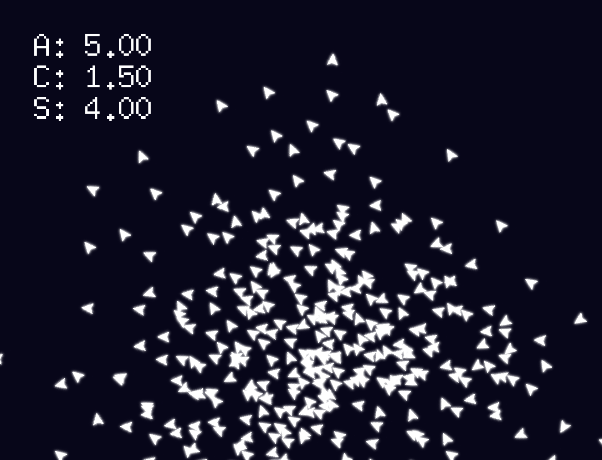

<p align="center"></p>

# Boid Simulation
## A visualization of emergent behaviour

### Introduction

In this project, we explore an example of a boids simulation — a simulation aiming to mimic the flocking 
behaviour of birds or the creation of schools of fish.

Boids (bird-oid objects) are individual autonomous agents following a set of simple predefined rules: separation, alignment and cohesion.

* Separation

    A boid steers away from other boids nearby to avoid crashing into them

* Alignment

    A boid steers in the average direction of the boids surrounding it

* Cohesion

    A boid steers towards the average position of the nearby boids


When each of the agents abides by these rules, we can notice a pattern of behaviour emerging from all of the boids. We call that the **emergent behaviour**. In this case, the emergent behaviour is the creation of flocks of individual boids.

### Design choices

Refer to the design [document](DESIGN.md).

### Requirements

* Go
([installation instructions](https://go.dev/doc/install))
    
    Tested with go1.17.3 for the linux/amd64 platform.


* Pixel ([GitHub](https://github.com/faiface/pixel)) 

    A hand-crafted 2D game library in Go.

To install all dependancies simply run 
```
go get ./...
```
while inside of the project directory.
If that doesn't work, to download and install the Pixel package manually, execute 
```
go get github.com/faiface/pixel
```
in your terminal window.

### Running the project

First, build the project by executing
`
go build .
`
Then, to run the project
```
./cs50-project
```
in your terminal.

### Usage

To change the variables used for the simulation, pass their values to the executable by using the relevant command-line arguments:
```
./cs50-project -a 4.0 -c 2.5 -s 3.0 -n 100
```
The above example sets the alignment factor to `4.0`, the cohesion factor to `2.5`, and the separation factor to `3.0`. The last flag specifies that a hundred boids is going to be simulated. 

To move the camera view around, simply click&drag using your mouse (similarly to Google Maps). You can also zoom in using your scroll wheel. 


To quit the simulation and exit the program, press the <kbd>Esc</kbd> key.

### Video showcase

This youtube [video](https://youtu.be/t9H1tSiELeU) showcases the project.

### Acknowledgements

A big **thank you** to the creators of the Go language, the Pixel library, as well as Craig Reynolds and his work on boid simulations.
